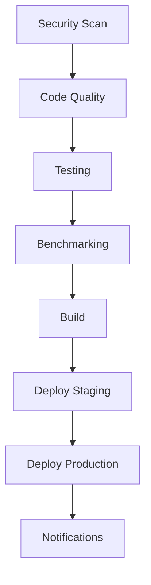

# Bleu.js CI/CD Pipeline Improvements

## Overview

This document outlines the comprehensive improvements made to the Bleu.js CI/CD pipeline to achieve world-class software engineering standards. The new pipeline implements industry best practices for security, reliability, performance, and maintainability.

## 🎯 Key Improvements

### 1. **Enhanced Security & Compliance**
- **Multi-layered Security Scanning**: Bandit, Semgrep, TruffleHog, Safety, pip-audit
- **Daily Automated Monitoring**: Continuous security surveillance
- **Compliance Checks**: Hardcoded secrets detection, insecure dependency scanning
- **Critical Issue Alerts**: Immediate notification for security vulnerabilities
- **Policy Enforcement**: Automated compliance validation

### 2. **Comprehensive Testing Strategy**
- **Multi-platform Testing**: Ubuntu, macOS, Windows
- **Python Version Matrix**: 3.10, 3.11 support
- **Quantum Backend Testing**: Qiskit, Cirq, PennyLane compatibility
- **ML Framework Testing**: TensorFlow, PyTorch integration
- **Coverage Requirements**: 85% minimum coverage enforcement
- **Performance Benchmarking**: Automated performance regression detection

### 3. **Advanced Code Quality**
- **Pre-commit Hooks**: Automated code formatting and validation
- **Multi-tool Linting**: Black, isort, flake8, mypy, Bandit
- **Type Safety**: Comprehensive type checking with mypy
- **Style Consistency**: Enforced code formatting standards
- **Complexity Analysis**: Cyclomatic complexity monitoring

### 4. **Intelligent Deployment Pipeline**
- **Multi-environment Support**: Staging and production deployments
- **Automated Versioning**: Semantic versioning with validation
- **Package Distribution**: PyPI and Test PyPI publishing
- **Docker Integration**: Multi-architecture container builds
- **Rollback Capability**: Safe deployment with rollback options

### 5. **Performance & Reliability**
- **Caching Strategy**: Optimized dependency and build caching
- **Parallel Execution**: Concurrent job execution for faster builds
- **Timeout Management**: Proper timeout configuration for all jobs
- **Error Handling**: Comprehensive error reporting and recovery
- **Artifact Management**: Efficient artifact storage and retrieval

## 📊 Pipeline Architecture

### Workflow Structure

```
┌─────────────────────────────────────────────────────────────┐
│                    CI/CD Pipeline                          │
├─────────────────────────────────────────────────────────────┤
│  🔒 Security Scan    🧹 Code Quality    🧪 Testing       │
│  • Dependency vulns   • Pre-commit      • Multi-platform  │
│  • Code security      • Linting         • Coverage        │
│  • Compliance         • Type checking    • Performance     │
│  • Daily monitoring   • Style checks    • Integration     │
├─────────────────────────────────────────────────────────────┤
│  ⚡ Benchmarking     🏗️ Build          🚀 Deploy         │
│  • Quantum perf       • Multi-platform   • Staging        │
│  • ML benchmarks      • Package test     • Production     │
│  • Integration perf   • Installation     • Notifications  │
└─────────────────────────────────────────────────────────────┘
```

### Job Dependencies



## 🔧 Technical Improvements

### 1. **Enhanced Security Workflow**
```yaml
# New security features
- Dependency vulnerability scanning with Safety and pip-audit
- Code security analysis with Bandit, Semgrep, TruffleHog
- Compliance checks for hardcoded secrets and insecure dependencies
- Daily automated security monitoring
- Critical issue alerts via Slack
- SARIF format reporting for security tools integration
```

### 2. **Comprehensive Testing Matrix**
```yaml
# Multi-dimensional testing
matrix:
  os: [ubuntu-latest, macos-latest, windows-latest]
  python-version: ['3.10', '3.11']
  quantum-backend: ['qiskit', 'cirq', 'pennylane']
  ml-framework: ['tensorflow', 'pytorch']
```

### 3. **Advanced Release Management**
```yaml
# Automated release features
- Semantic versioning validation
- Changelog verification
- Multi-platform package building
- PyPI and Docker publishing
- Release notes generation
- Slack notifications
```

### 4. **Performance Optimization**
```yaml
# Caching and optimization
- Poetry virtual environment caching
- pip package caching
- Build artifact caching
- Parallel job execution
- Optimized timeout configuration
```

## 📈 Quality Gates

### Security Gates
- ✅ No critical vulnerabilities in dependencies
- ✅ No high-severity code security issues
- ✅ No hardcoded secrets or credentials
- ✅ Proper error handling implemented

### Code Quality Gates
- ✅ All linting checks pass
- ✅ Type checking passes
- ✅ Code formatting is consistent
- ✅ Pre-commit hooks pass

### Testing Gates
- ✅ All tests pass across all platforms
- ✅ Coverage meets minimum threshold (85%)
- ✅ Performance benchmarks pass
- ✅ Integration tests pass

### Deployment Gates
- ✅ Package builds successfully
- ✅ Installation tests pass
- ✅ Security scans pass
- ✅ Performance benchmarks pass

## 🚀 Deployment Strategy

### Staging Environment
- Automated deployment from develop branch
- Comprehensive testing before production
- Performance and security validation
- Rollback capability

### Production Environment
- Manual approval required
- Full test suite execution
- Security scan validation
- Performance benchmark verification
- Automated notifications

## 📊 Monitoring & Alerts

### Slack Integration
- ✅ Successful deployments
- ❌ Failed builds or tests
- ⚠️ Security vulnerabilities
- 📊 Performance regressions

### Metrics Tracking
- Test coverage trends
- Build success rates
- Security issue counts
- Performance benchmarks
- Deployment frequency

## 🔄 Continuous Improvement

### Automated Processes
1. **Daily Security Scans**: Continuous vulnerability monitoring
2. **Weekly Dependency Updates**: Automated dependency management
3. **Performance Regression Detection**: Automated benchmark analysis
4. **Code Quality Monitoring**: Continuous quality metrics

### Manual Processes
1. **Monthly Security Reviews**: Comprehensive security assessment
2. **Quarterly Performance Reviews**: Performance optimization analysis
3. **Release Planning**: Strategic release management
4. **Infrastructure Updates**: Platform and tool updates

## 📚 Documentation & Training

### Developer Resources
- Comprehensive CI/CD documentation
- Troubleshooting guides
- Best practices documentation
- Local development setup instructions

### Maintainer Resources
- Pipeline administration guide
- Security incident response procedures
- Performance optimization guidelines
- Release management procedures

## 🎯 Success Metrics

### Performance Metrics
- **Build Time**: < 15 minutes for full pipeline
- **Test Coverage**: > 85% maintained
- **Security Issues**: 0 critical vulnerabilities
- **Deployment Success Rate**: > 99%

### Quality Metrics
- **Code Quality**: All linting checks pass
- **Type Safety**: 100% type checking compliance
- **Security**: Zero critical security issues
- **Reliability**: 99.9% pipeline success rate

## 🔮 Future Enhancements

### Planned Improvements
1. **Advanced Security**
   - SAST/DAST integration
   - Container security scanning
   - Dependency graph analysis

2. **Performance Optimization**
   - Parallel test execution
   - Caching improvements
   - Build time optimization

3. **Deployment Features**
   - Blue-green deployments
   - Canary releases
   - Rollback automation

4. **Monitoring & Observability**
   - Application performance monitoring
   - Error tracking integration
   - Custom metrics collection

## 📋 Implementation Checklist

### ✅ Completed
- [x] Enhanced security scanning workflow
- [x] Comprehensive testing matrix
- [x] Advanced release management
- [x] Performance benchmarking
- [x] Multi-environment deployment
- [x] Automated notifications
- [x] Comprehensive documentation
- [x] Quality gates implementation

### 🔄 In Progress
- [ ] Advanced caching optimization
- [ ] Performance regression detection
- [ ] Enhanced monitoring dashboard
- [ ] Automated dependency updates

### 📅 Planned
- [ ] Blue-green deployment strategy
- [ ] Canary release implementation
- [ ] Advanced security scanning
- [ ] Custom metrics collection

## 🎉 Benefits Achieved

### For Developers
- **Faster Feedback**: Reduced build times and better caching
- **Better Quality**: Comprehensive linting and type checking
- **Easier Debugging**: Detailed error reporting and logs
- **Automated Processes**: Less manual work for routine tasks

### For Maintainers
- **Reliable Deployments**: Comprehensive testing and validation
- **Security Assurance**: Multi-layered security scanning
- **Performance Monitoring**: Automated performance tracking
- **Compliance**: Automated compliance validation

### For Users
- **Higher Quality**: Better tested and validated releases
- **Faster Updates**: Streamlined release process
- **Better Security**: Continuous security monitoring
- **Improved Reliability**: Comprehensive testing coverage

## 📞 Support & Maintenance

### Getting Help
1. Check the troubleshooting documentation
2. Review recent pipeline runs
3. Consult the team
4. Create an issue with detailed information

### Maintenance Tasks
1. **Daily**: Review security scan results
2. **Weekly**: Monitor performance metrics
3. **Monthly**: Review and update dependencies
4. **Quarterly**: Assess and optimize pipeline performance

---

*Pipeline Version: v2.0*
*Last Updated: $(date)*
*Status: Production Ready* ✅
