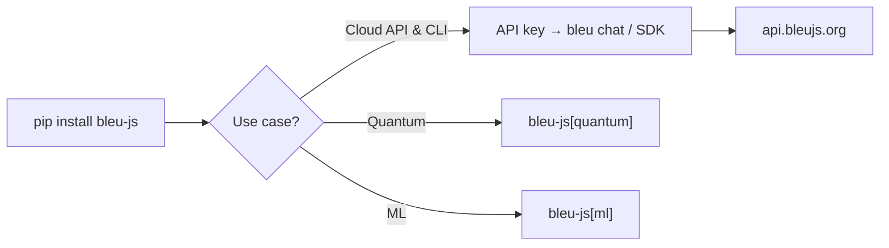

# Bleu.js

**Quantum-enhanced AI platform: cloud API, CLI, and Python SDK.** [bleujs.org](https://bleujs.org) — *Get your first API call in under two minutes.*

[](https://www.python.org/downloads/)
[](LICENSE)
[]()
[](https://github.com/HelloblueAI/Bleu.js/actions)


<div align="left">
  <a href="https://htmlpreview.github.io/?https://github.com/HelloblueAI/Bleu.js/blob/main/simple_animated_demo.html" target="_blank">
    
  </a>
  <a href="https://htmlpreview.github.io/?https://github.com/HelloblueAI/Bleu.js/blob/main/api_playground.html" target="_blank">
    
  </a>
</div>

Bleu.js combines classical machine learning with optional quantum computing.

**Efficient by default, powerful by choice.** `pip install bleu-js` ships the **API client + CLI** only (no torch/shap/numba). Add `[ml]`, `[quantum]`, `[deep]`, or `[all]` when you need heavier stacks.

| | |
|---|---|
| **Who it's for** | ML engineers, researchers, and developers building cloud APIs or CLI tools |
| **Status** | Beta — [Changelog](CHANGELOG.md) · [Roadmap](docs/ROADMAP.md) |
| **Security** | No secrets in repo — [SECURITY.md](SECURITY.md) |
| **Repos** | This SDK + [bleujs.org](https://github.com/HelloblueAI/bleujs.org) — [map](docs/REPOSITORIES.md) |

---

## Get started in 60 seconds

**1. Install** (Python 3.11+):

```bash
pip install bleu-js
```

**2. Get an API key** at [bleujs.org](https://bleujs.org), then set it:

```bash
export BLEUJS_API_KEY="bleujs_sk_your_key_here"
# or: bleu config set api-key bleujs_sk_your_key_here
```

**3. Run:**

```bash
bleu chat "Say hello in one word."
```

Or in Python:

```python
from bleujs.api_client import BleuAPIClient
print(BleuAPIClient().chat([{"role": "user", "content": "Say hello."}]).content)
```

**4. Verify** (optional): `bleu version` or `bleujs version` · `bleu health` or `bleujs health`

**Walkthrough:** [Get started](docs/GET_STARTED.md) · [Quickstart](docs/QUICKSTART.md) · [API Client Guide](docs/API_CLIENT_GUIDE.md)

---

## For developers (clone & contribute)

```bash
git clone https://github.com/HelloblueAI/Bleu.js.git && cd Bleu.js
python -m venv .venv && source .venv/bin/activate   # Windows: .venv\Scripts\activate
pip install -e .
cp .env.example .env   # set BLEUJS_API_KEY
bleu chat "Hello"
```

| Need | Install |
|------|---------|
| SDK + CLI (daily dev) | `pip install -e .` |
| Tests / CI parity | `pip install -e ".[ci]"` |
| Self-host FastAPI app | `pip install -e ".[server]"` |
| Full ML + quantum + server | `pip install -e ".[all]"` |

**Setup:** [Contributing → Development setup](docs/CONTRIBUTING.md#-development-setup) · [Install from source](docs/INSTALLATION.md#using-pip-from-source)

---

## Optional extras

| Extra | Install | Use case |
|-------|---------|----------|
| Default | `pip install bleu-js` | API client + CLI |
| ML | `pip install "bleu-js[ml]"` | XGBoost, scikit-learn |
| Quantum | `pip install "bleu-js[quantum]"` | Qiskit, PennyLane |
| Deep | `pip install "bleu-js[deep]"` | PyTorch, TensorFlow |
| Server | `pip install -e ".[server]"` | Self-host product app |
| Full | `pip install "bleu-js[all]"` | Everything |

**Self-host:** copy [`.env.example`](.env.example) → `.env`, then `python main.py`. See [INSTALLATION.md](docs/INSTALLATION.md) and [SECURITY.md](SECURITY.md).

---

## SDK & CLI (quick reference)

Hosted API: `https://api.bleujs.org` — get a key at [bleujs.org](https://bleujs.org).

```python
from bleujs.api_client import BleuAPIClient

client = BleuAPIClient()  # reads BLEUJS_API_KEY
print(client.chat([{"role": "user", "content": "What is quantum computing?"}]).content)
print(client.generate("Write a haiku about AI:").text)
print(client.embed(["text1", "text2"]).embeddings)
```

```bash
export BLEUJS_API_KEY=bleujs_sk_...
bleu chat "Explain quantum computing"
bleu generate "Once upon a time" --max-tokens 500
bleu embed "hello" "world"
bleu models list
bleu health
```

Both `bleu` and `bleujs` command names work. **Full CLI/SDK docs:** [API Client Guide](docs/API_CLIENT_GUIDE.md) · [Examples](examples/README.md)

---

## Documentation map

| I want to… | Start here |
|------------|------------|
| Install or upgrade | [INSTALLATION.md](docs/INSTALLATION.md) |
| Which package to install | [PACKAGE_MAP.md](docs/PACKAGE_MAP.md) |
| First API call | [GET_STARTED.md](docs/GET_STARTED.md) |
| SDK, CLI, API contract | [API_CLIENT_GUIDE.md](docs/API_CLIENT_GUIDE.md) |
| API reference | [API_REFERENCE.md](docs/API_REFERENCE.md) |
| Architecture & features | [PRODUCT_ARCHITECTURE.md](docs/PRODUCT_ARCHITECTURE.md) · [Platform overview](docs/PLATFORM_OVERVIEW.md) |
| Quantum / ML examples | [examples/](examples/) · [Quantum teleportation](docs/QUANTUM_TELEPORTATION.md) |
| Benchmarks | [ACHIEVEMENTS.md](docs/ACHIEVEMENTS.md) · [PERFORMANCE.md](docs/PERFORMANCE.md) |
| Change the API (both repos) | [CHANGING_THE_API.md](docs/CHANGING_THE_API.md) |
| Contribute | [CONTRIBUTING.md](docs/CONTRIBUTING.md) · [Contributor guide](docs/CONTRIBUTOR_GUIDE.md) |
| Security & deployment | [SECURITY.md](SECURITY.md) · [DEPLOYMENT_PRACTICES.md](docs/DEPLOYMENT_PRACTICES.md) |
| FAQ | [USER_CONCERNS_AND_FAQ.md](docs/USER_CONCERNS_AND_FAQ.md) |
| Evaluation / awards | [EVALUATION_AND_AWARDS.md](docs/EVALUATION_AND_AWARDS.md) |

---

## Architecture (at a glance)


```mermaid
flowchart LR
    A["pip install bleu-js"] --> B{Use case?}
    B -->|Cloud API & CLI| C[API key → bleu chat / SDK]
    B -->|Quantum| D["bleu-js[quantum]"]
    B -->|ML| E["bleu-js[ml]"]
    C --> F[api.bleujs.org]
```

Production **chat / generate / embed** are served by **[bleujs.org](https://bleujs.org)**. Details: [Who serves the API](docs/WHO_SERVES_THE_API.md) · [Product philosophy](docs/PRODUCT_PHILOSOPHY.md).

---

## Contributing

We welcome contributions — [good first issues](https://github.com/HelloblueAI/Bleu.js/issues?q=is%3Aopen+label%3A%22good+first+issue%22), docs, and tests.

[Contributing guide](docs/CONTRIBUTING.md) · [Maintainers](MAINTAINERS.md) · [Code of Conduct](CODE_OF_CONDUCT.md) · [Discussions](https://github.com/HelloblueAI/Bleu.js/discussions)

**Support:** support@helloblue.ai · **Security:** security@helloblue.ai (use [SECURITY.md](SECURITY.md), not public issues)

---

## License

Bleu.js is licensed under the [MIT License](LICENSE). Maintained by [Helloblue Inc.](https://helloblue.ai) — see [MAINTAINERS.md](MAINTAINERS.md).
