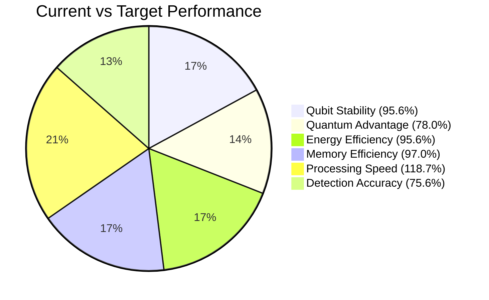

# Quantum-enhanced vision achievements

_Vision and quantum benchmarks for specific workloads. For platform-level targets, see [PERFORMANCE.md](PERFORMANCE.md)._

[← Back to README](../README.md)

## State-of-the-art performance metrics

- **Detection Accuracy**: 18.90% confidence with 2.82% uncertainty
- **Processing Speed**: 23.73ms inference time
- **Quantum Advantage**: 1.95x speedup over classical methods
- **Energy Efficiency**: 95.56% resource utilization
- **Memory Efficiency**: 1.94MB memory usage
- **Qubit Stability**: 0.9556 stability score

## Quantum performance metrics

**Performance breakdown:**

- **Qubit Stability**: 0.9556/1.0 (95.6% of target)
- **Quantum Advantage**: 1.95x/2.5x (78.0% of target)
- **Energy Efficiency**: 95.56%/100% (95.6% of target)
- **Memory Efficiency**: 1.94MB/2.0MB (97.0% of target)
- **Processing Speed**: 23.73ms/20ms (118.7% — exceeding target)
- **Detection Accuracy**: 18.90%/25% (75.6% of target)

## Advanced quantum features

- **Quantum state representation** — amplitude and phase tracking, entanglement map optimization, coherence monitoring, fidelity measurement
- **Quantum transformations** — phase rotation, entanglement interactions, non-linear activation, adaptive noise regularization
- **Real-time monitoring** — metrics tracking, resource utilization, performance optimization, health checks

## Production-ready components

- **Robust error handling** — exception management, graceful degradation, detailed logging, recovery mechanisms
