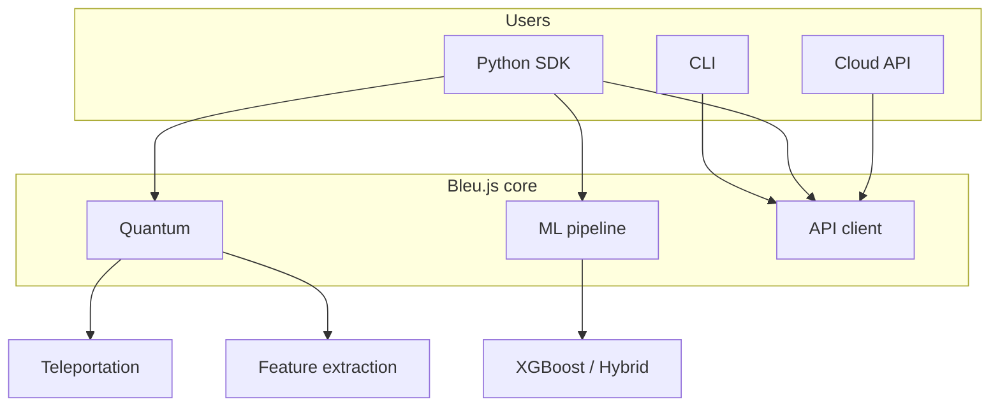
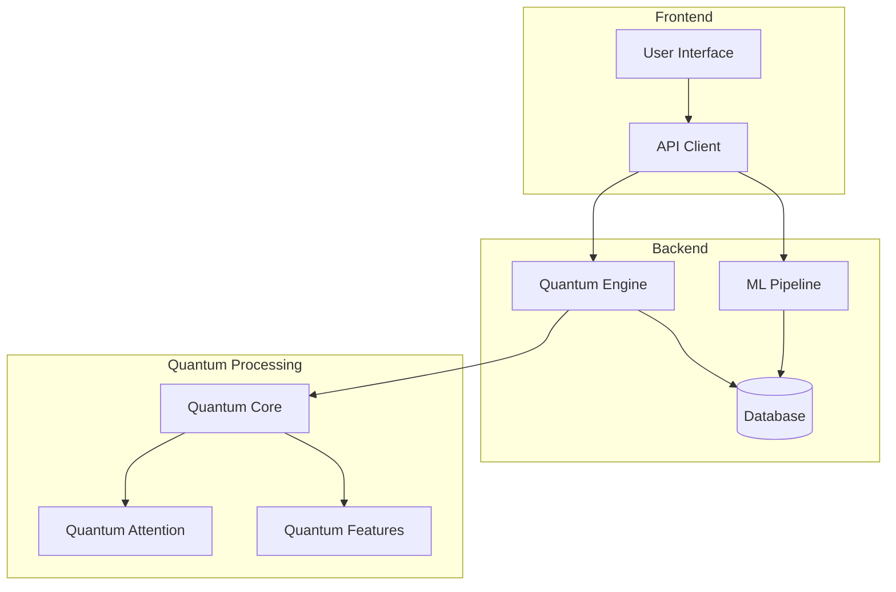
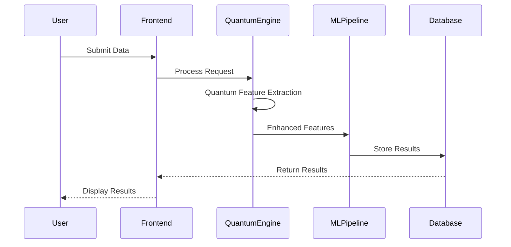
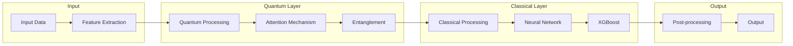

# Platform overview

Key features, architecture diagrams, and local development notes. For the product app and bleujs.org, see [PRODUCT_ARCHITECTURE.md](PRODUCT_ARCHITECTURE.md).

[← Back to README](../README.md)

## Key features



- **Quantum computing integration** — optional Qiskit/PennyLane stack via `[quantum]`
- **Multi-modal AI processing** — cross-domain learning capabilities
- **Performance optimization** — real-time monitoring and workflow analysis
- **Cloud-first API** — `api.bleujs.org` with Python SDK and CLI

See [PRODUCT_PHILOSOPHY.md](PRODUCT_PHILOSOPHY.md) for positioning principles.

## Pre-trained models (Hugging Face)

[](https://huggingface.co/helloblueai)

- **[Bleu.js XGBoost Classifier](https://huggingface.co/helloblueai/bleu-xgboost-classifier)** — quantum-enhanced XGBoost with scaler and model card

```python
from huggingface_hub import hf_hub_download
import pickle

model_path = hf_hub_download(
    repo_id="helloblueai/bleu-xgboost-classifier",
    filename="xgboost_model_latest.pkl",
)
with open(model_path, "rb") as f:
    model = pickle.load(f)
```

## Local `BleuJS` quick start

Requires optional extras — see [INSTALLATION.md](INSTALLATION.md).

```python
from bleujs import BleuJS

bleu = BleuJS(
    quantum_mode=True,
    model_path="models/quantum_xgboost.pkl",
    device="cuda",
)
results = bleu.process(
    input_data="your_data",
    quantum_features=True,
    attention_mechanism="quantum",
)
```

## Code examples

### Quantum feature extraction

```python
from bleujs.quantum import QuantumFeatureExtractor

extractor = QuantumFeatureExtractor(num_qubits=4, entanglement_type="full")
features = extractor.extract(data=your_data, use_entanglement=True)
```

### Quantum teleportation

See [QUANTUM_TELEPORTATION.md](QUANTUM_TELEPORTATION.md).

```bash
pip install -e ".[quantum]"
bleu quantum teleport --theta 0.9 --shots 1024
```

### Hybrid model training

```python
from bleujs.ml import HybridTrainer

trainer = HybridTrainer(model_type="xgboost", quantum_components=True)
model = trainer.train(X_train=X_train, y_train=y_train, quantum_features=True)
```

More: [examples/README.md](../examples/README.md)

## Development

- **Tests:** `pytest tests/ -q` (use `pip install -e ".[ci]"` for CI parity)
- **Version:** `bleu version` or `from bleujs import __version__`
- **SDK errors:** `BleuAPIError`, `RateLimitError`, `AuthenticationError` from `bleujs`
- **Contribute:** [CONTRIBUTING.md](CONTRIBUTING.md)

## Reliability

When dependencies are unavailable, the API returns **503 Service Unavailable**. SDK users should catch `BleuAPIError` and `RateLimitError`. Self-hosted app middleware uses `ServiceUnavailable` and `RateLimitExceeded` from `src`.

## CI/CD

GitHub Actions runs tests, Black/isort/flake8/mypy, and security scans (Bandit, Safety, pip-audit). See [`.github/workflows/main.yml`](../.github/workflows/main.yml).

## System architecture



## Data flow



## Model architecture


