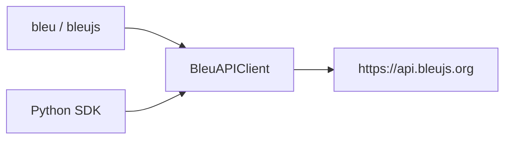

# Platform overview

What this repository contains today. The public hosted API is `https://api.bleujs.org`. This file does not describe how that service is deployed.

[← Back to README](../README.md)

## What ships

| Piece | What it is | Where |
| ----- | ---------- | ----- |
| Python SDK | `BleuAPIClient` and `AsyncBleuAPIClient` call the hosted API | `src/bleujs/api_client/` |
| CLI | `bleu` and `bleujs` | `src/bleujs/cli.py` |
| API contract | Public request and response shapes | `docs/api/openapi.yaml` |
| Edge stub | Local and CI stand-in for the contract | `services/edge-stub/` |
| Self-hosted app | Optional FastAPI app | `src/main.py`, extra `[server]` |
| Optional ML | `HybridTrainer` | `src/bleujs/ml.py`, extra `[ml]` |
| Optional quantum | `QuantumFeatureExtractor` and `bleu quantum teleport` | `src/bleujs/quantum.py`, `src/bleujs/teleportation.py`, extra `[quantum]` |

`pip install bleu-js` is the SDK and CLI only. ML, quantum, deep learning, and the self-hosted app are extras. They are not the hosted API.

See [PRODUCT_ARCHITECTURE.md](PRODUCT_ARCHITECTURE.md).

## How the SDK and CLI call the API


```mermaid
flowchart LR
    CLI["bleu / bleujs"] --> Client["BleuAPIClient"]
    SDK["Python SDK"] --> Client
    Client --> API["https://api.bleujs.org"]
```

```python
from bleujs.api_client import BleuAPIClient

client = BleuAPIClient()  # reads BLEUJS_API_KEY; base URL is https://api.bleujs.org
print(client.chat([{"role": "user", "content": "Say hello."}]).content)
```

```bash
export BLEUJS_API_KEY=bleujs_sk_...
bleu chat "Say hello."
bleu health
```

Set `BLEUJS_BASE_URL` only when the client should call a host other than `https://api.bleujs.org`.

## Optional local modules

These run in the environment where the extra is installed. They are not a description of the hosted service.

**ML** (`pip install "bleu-js[ml]"`): `HybridTrainer` in `src/bleujs/ml.py` fits an XGBoost classifier when XGBoost is installed. Otherwise it fits a scikit-learn random forest, or a small local fallback if neither library is installed.

**Quantum** (`pip install "bleu-js[quantum]"`): `QuantumFeatureExtractor` in `src/bleujs/quantum.py` encodes input into a Qiskit or PennyLane circuit and returns the resulting feature array. `bleu quantum teleport` runs the circuit in `src/bleujs/teleportation.py` (simulator, or IBM Quantum when `QISKIT_IBM_TOKEN` is set).

**Self-hosted app** (`pip install -e ".[server]"` from a clone): `python main.py` starts `src/main.py`. Copy [`.env.example`](../.env.example) to `.env` and set `SECRET_KEY` and `DATABASE_URL`. See [INSTALLATION.md](INSTALLATION.md) and [SECURITY.md](../SECURITY.md).

## Development

- Python 3.11, 3.12, or 3.13 (`requires-python` in `pyproject.toml` is `>=3.11,<3.14`)
- SDK and CLI: `pip install -e .`
- Tests: `pip install -e ".[ci]"` and `pip install -r requirements-dev.txt`, then `pytest tests/ -q`
- Version: `bleu version` or `from bleujs import __version__`
- SDK errors: `BleuAPIError`, `RateLimitError`, and `AuthenticationError` from `bleujs.api_client`
- Contribute: [CONTRIBUTING.md](CONTRIBUTING.md)

## CI

[`.github/workflows/main.yml`](../.github/workflows/main.yml) runs the test suite, Black, isort, flake8, mypy, Bandit, Safety, and pip-audit.
